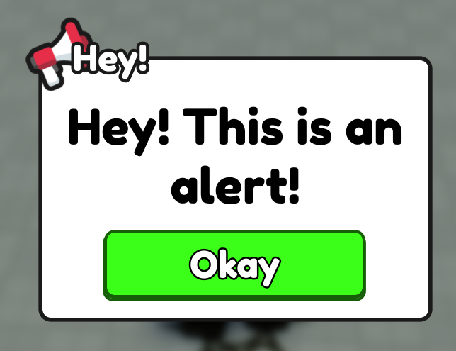

To use the Alerts, you want to grab the framework as per usual, and reference the GUI section of the Framework.
:::info
The alerts are queued into an array, this means you can add multiple alerts at one time without discarding the current one!
:::

```lua
local Framework = require(path.to.framework).GetClient()
local GUI = Framework.GUI
```

Then, to send Alerts to the Player, you'll want to do:

```lua
GUI.Alert.new("Hey! This is an alert!")
```

Here is what that would look like:

