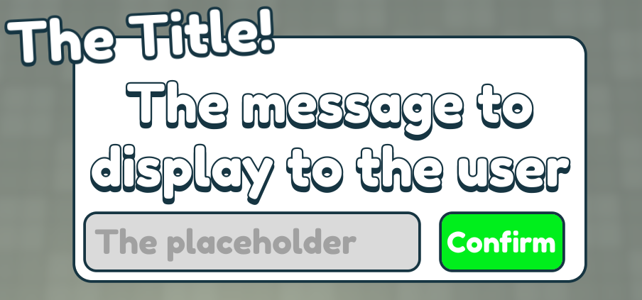

This allows you to make the user input values, strings or anything into an TextBox, and retrieve the result!

:::info
This is also queued! Like the alerts, you can get as many inputs as you like!
:::

First grab the Framework:
```lua
local Framework = require(path.to.framework).GetClient()
local GUI = Framework.GUI
```

And then, do the following:
```lua
GUI.InputBox.new("The Title!", "The message to display to the user", "The placeholder", function(returned) 
    print(`The returned value was... {returned}!`)
end)
```

This would be the outcome:

