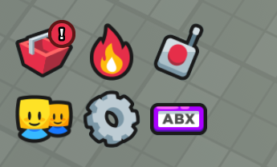

On the left side of the players screen, there are multiple buttons like so:



You can create 'custom' buttons that can do almost anything, from opening frames to kicking the player.

The menu button takes in 3 parameters:
- The Image ID for the icon
- The Tooltip Text when hovering over the button
- A custom function to run or a frame to toggle

Here's an example:
```lua
local Framework = require(path.to.framework).GetClient()
local GUI = Framework.GUI

-- This creates a menu button that calls a function on click!
GUI.MenuButton.createMenuButton(15872795453, "Custom", function() 
    game:GetService("Players").LocalPlayer:Kick("kicked")
end)

-- This passes in a frame, and the menu button handles the process of opening and closing the frame
local FrameToOpen = game.Players.LocalPlayer.PlayerGui:WaitForChild("UI"):WaitForChild("Content").Codes
GUI.MenuButton.createMenuButton(15997325157, "Custom 2", FrameToOpen)
```