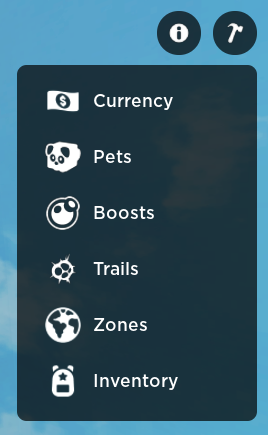
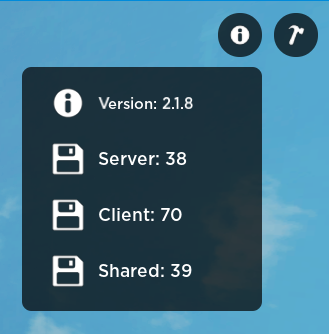

# Introduction
The framework comes with many tools you can use to test your games with, including:
```
│ Currency Tools
│ Pet Giver
│ Boost Tools
│ Trails Giver
│ Zones Manipulator
│ Inventory Editor
```



The tools above are accessible by admins, however the framework 'info' is not.



The info tool shows how many modules are loaded in the different areas

It's pretty much useless but it looks cool.