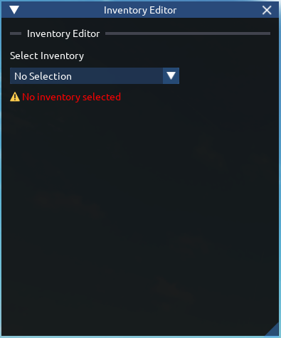
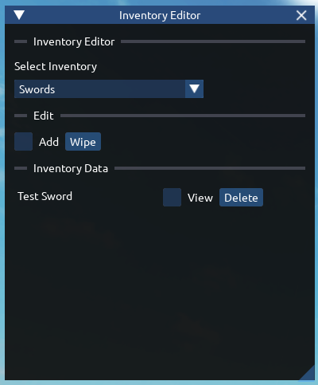
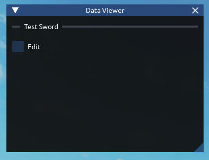
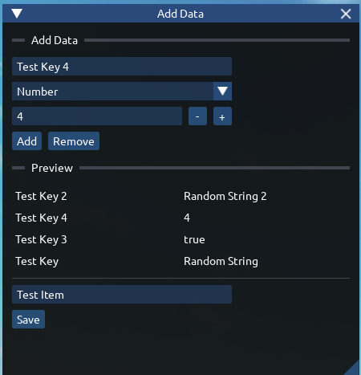
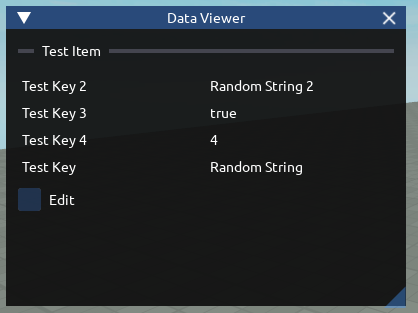

# Inventory Editor
This is the only one that actually is at first difficult to grasp.

This is a volatile tool, you can break things with this during gameplay in both studio and runtime.

# Introduction

This is what you first see when using the UI. Everything here on out is pretty much easy.

You'll first want to select an inventory, and all the info will show up.

# Viewing inventory data

Here, you can see all your data in the dictionary show up.
:::warning
If it's an array, you will see the bare minimum and features will be disabled.
:::

# Viewing Item Data
Viewing data is simple.

You can see data here, edit data, etc. Editing is the same as adding data

# Adding data

Adding data is as simple as choosing a key, value type and adding it into the dictionary.

Pressing Save automatically adds and saves your data. This can be useful for things like quests, notebook system etc.

This is example the same as Editing Data, so you just follow the same process when editing.

Your final data will look like this when viewing it again:

Thanks to Iris (Dear ImGui port), making internal tools is easy, and saves time.